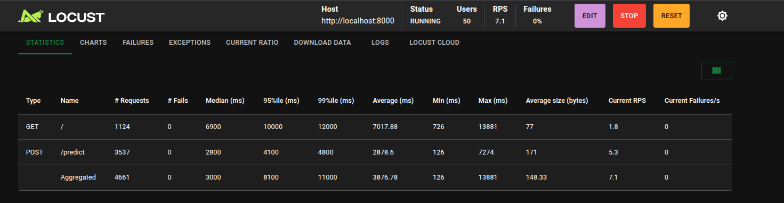

# **🫀 ARCADE - AI-Powered Coronary Stenosis Detection**

**Advanced Medical Diagnostics through Computer Vision**

**ARCADE** is an end-to-end Machine Learning Operations (MLOps) pipeline designed to detect **Coronary Artery Stenosis** (narrowing of blood vessels) from X-ray Angiography images. It bridges the gap between medical imaging and automated diagnostics using deep learning.

### **📹 Video Demo**

[Click here for the video demo](https://youtu.be/xvGsVLVcM-M)

### **🌐 Live Deployment**


*   **Frontend Dashboard**: https://coronaryscanai-imjaza97b6ciwlznwjcds2.streamlit.app/
*   **Backend API**: https://coronaryscan-ai.onrender.com


    **Note**: The system is deployed using a microservices architecture. The Frontend runs on **Streamlit Cloud**, while the Backend API is containerized and hosted on **Render**.


### **🏗️ Architecture**

The project follows a decoupled Full-Stack ML architecture:

**Backend**


*   **Framework**: FastAPI (High-performance Python API)
*   **ML Core**: TensorFlow/Keras (EfficientNetB0 with Transfer Learning)


*   **Inference**: Custom `Predictor` class with Test Time Augmentation (TTA)
*   **Infrastructure**: Docker Container (Debian 12 / Python 3.11) with Production Healthchecks

**Frontend**


*   **Framework**: Streamlit (Python-based UI)
*   **Features**: Real-time Inference, Data Visualization, Pipeline Triggering
*   **Communication**: REST API calls to the Backend

### **🧠 Machine Learning Strategy**

We approach Stenosis Detection as a binary image classification problem (**Healthy** vs. **Stenosis**).


*   **Dataset**: [ARCADE Dataset](https://www.kaggle.com/datasets/nikitamanaenkov/annotated-x-ray-angiography-dataset) (1,600 curated X-ray images)
*  **Preprocessing**:

      *   Resize to **224x224** (Standard ImageNet resolution)
      *   Grayscale Conversion
      *   **RGB Adapter**: Automatic channel duplication (1 → 3 channels) to leverage pre-trained weights

*   **Model Architecture: EfficientNetB0**

      *  Selected for its high accuracy-to-parameter ratio (ideal for cloud deployment)
      *   Transfer Learning: Pre-trained on ImageNet, with the top 50 layers fine-tuned for medical textures

*   **Test Time Augmentation (TTA):**
      *   To improve reliability, the system predicts on both the original and a horizontally flipped version of the X-ray, averaging the confidence scores to reduce false positives.


### **📁 Directory Structure**


```
CoronaryScan_AI/
├── README.md                  # Project Documentation
├── requirements.txt           # Minimal Dependencies (FastAPI, TensorFlow-CPU)
├── Dockerfile                 # Production-ready Docker image configuration
├── docker-compose.yaml        # Local orchestration (API + UI simulation)
├── locustfile.py              # Load Testing Suite
│
├── models/                    # Model Artifacts
│   └── arcade_model.h5       # Trained EfficientNetB0 Model
│
└── src/                       # Source Code
    ├── api.py                # FastAPI Application Entrypoint
    ├── ui.py                 # Streamlit Dashboard
    ├── model.py              # Model Architecture Definition
    ├── preprocessing.py      # Image Transformation Pipeline
    └── prediction.py         # Inference Logic & TTA Wrapper
```

### **🚀 Getting Started**

**Prerequisites**


*   Docker Desktop
*   Python 3.9+

**1. Local Deployment (Docker)**

The easiest way to run the full system locally is via Docker Compose.


```
# Build and start the services
docker compose up --build

```


*   **API**: http://localhost:8000
*   **Dashboard**: http://localhost:8501

**2. Manual Setup (Python)**

If you prefer running without Docker:


```
# Create virtual environment
python -m venv venv
source venv/bin/activate  # Windows: venv\Scripts\activate

# Install dependencies
pip install -r requirements.txt

# Terminal 1: Start API
uvicorn src.api:app --reload

# Terminal 2: Start Dashboard
streamlit run src/ui.py


```

### **📡 API Endpoints**

| **Method** | **Endpoint** | **Description** |
| `GET` | `/` | **Health Check**. Returns system status and model availability. |
| `POST`| `/predict` | Inference. Upload an image (`.png`, `.jpg`) to get a diagnosis. |
| `POST` | `/retrain` | **MLOps Trigger**. Simulates a background retraining pipeline. |

**Example Response **(`/predict`):

```
{
  "diagnosis": "Stenosis (Unhealthy)",
  "confidence": 0.85,
  "raw_score": 0.8512,
  "is_abnormal": true,
  "tta_details": {
    "original": 0.82,
    "flipped": 0.88
  }
}

```

### **🧪 Load Testing & Performance**



**Test Configuration**


*   Users: 50 Concurrent Users
*   Spawn Rate: 5 Users/second
*   Target: Production Docker Container (Limited to 1.5 CPUs)

**Results**

*  **Throughput**: ~7.1 Requests Per Second (RPS)
*   **Failure Rate**: 0% (Zero crashes under load)
*   **Average Latency**: ~2800ms (Due to deep learning inference on CPU)


